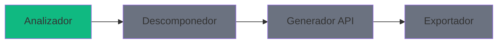

# Documentación del ERP Modernization Toolkit

Bienvenido a la documentación técnica del ERP Modernization Toolkit.

## Índice

| Documento | Descripción |
|-----------|-------------|
| [Guía de Uso](./usage.md) | Cómo usar el toolkit, ejemplos y API |
| [Arquitectura](./architecture.md) | Diseño del sistema, componentes y decisiones |
| [Diagramas de Secuencia](./sequences.md) | Flujos de ejecución detallados |
| [Patrones de Diseño](./patterns.md) | Patrones aplicados en la implementación |

## Inicio Rápido

```typescript
import { Analyzer } from 'erp-modernization-toolkit';

const analyzer = new Analyzer();
const report = await analyzer.analyze('/ruta/proyecto-legacy');

// El reporte contiene:
// - modules: lista de módulos detectados
// - dependencyGraph: grafo de dependencias
// - metrics: métricas de acoplamiento por módulo
// - dbDependencies: referencias a base de datos
// - warnings: advertencias del análisis
```

## Lenguajes Soportados

El toolkit analiza código fuente en 11 lenguajes legacy ERP:

- DataFlex, COBOL, ABAP, RPG, Progress 4GL
- PL/SQL, Visual FoxPro, Delphi, PowerBuilder
- Natural, Pick/BASIC

## Módulos del Sistema



- 🟢 **Analizador** — Implementado
- ⬜ **Descomponedor** — Pendiente
- ⬜ **Generador API** — Pendiente
- ⬜ **Exportador** — Pendiente
