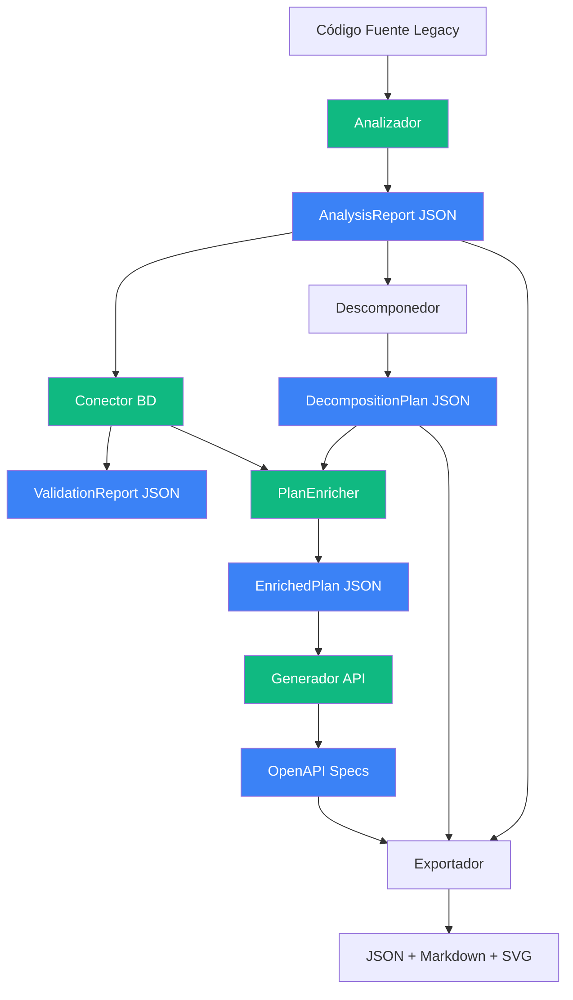
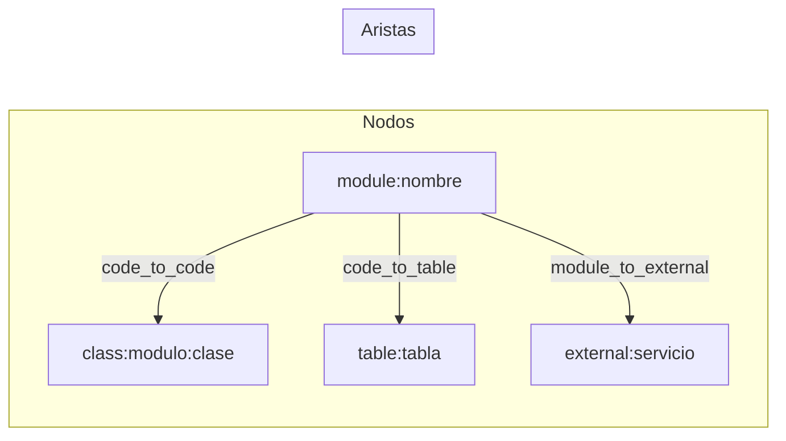
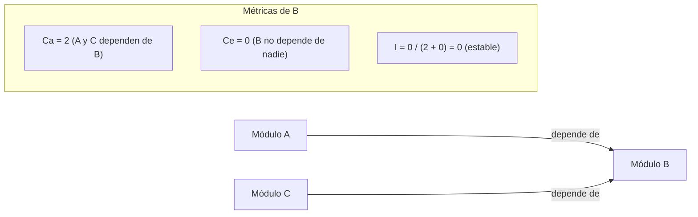
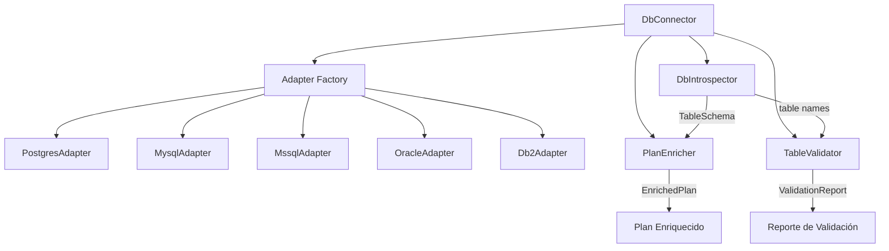
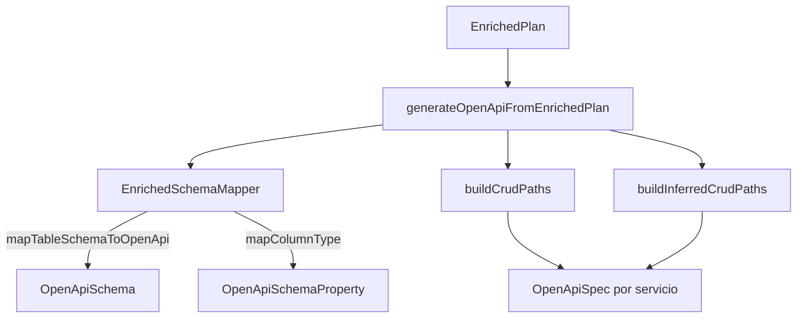
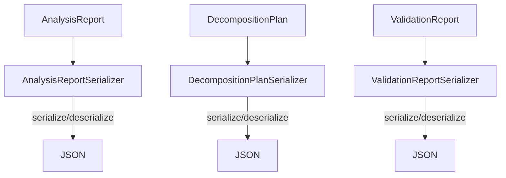
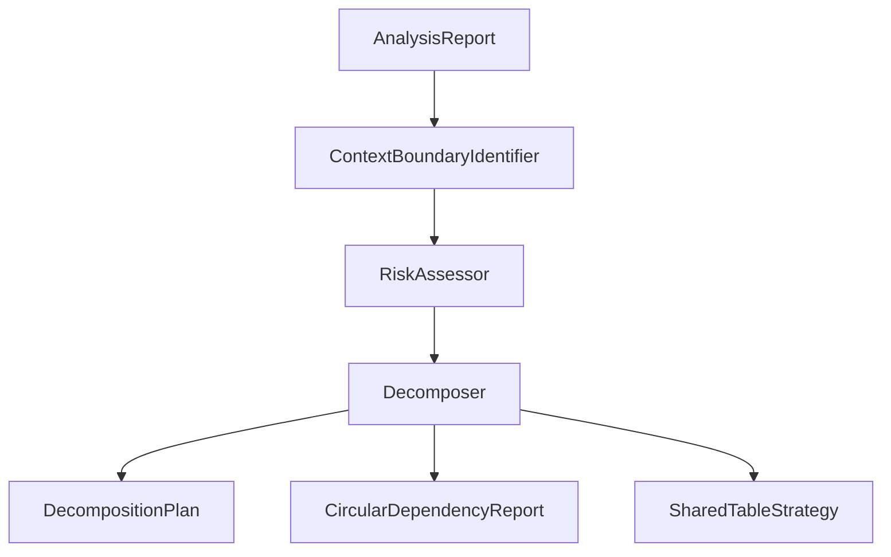
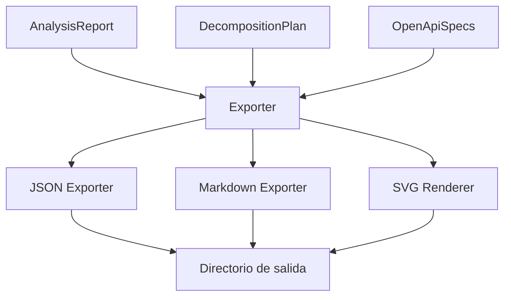
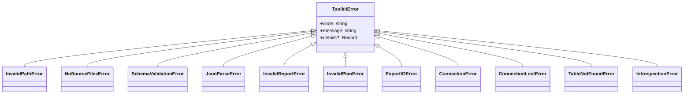

# Arquitectura

## Visión General del Sistema

El ERP Modernization Toolkit es un pipeline de múltiples etapas que transforma código legacy en artefactos de modernización.



## Decisiones de Diseño

| Decisión | Justificación |
|----------|---------------|
| TypeScript | Tipado estático, soporte JSON nativo, ecosistema de análisis |
| Interfaces por componente | Desacoplamiento, testabilidad, extensibilidad |
| JSON como formato de intercambio | Estándar, validable con JSON Schema |
| Plugin registry para parsers | Agregar lenguajes sin modificar código existente |
| Adapter pattern para BD | Soportar múltiples motores con interfaz unificada |
| Enriquecimiento aditivo | El plan original se preserva intacto, la metadata de BD se agrega |
| SVG programático | Sin dependencias de renderizado externo |

## Arquitectura del Analizador

El Analizador es el módulo más complejo. Orquesta cuatro sub-componentes:

```mermaid
graph TD
    A[Analyzer] --> S[CodeScanner]
    A --> D[DbDependencyDetector]
    A --> G[GraphBuilder]
    A --> M[MetricsCalculator]

    S --> PR[ParserRegistry]
    D --> PR

    PR --> P1[DataFlexParser]
    PR --> P2[CobolParser]
    PR --> P3[AbapParser]
    PR --> P4[RpgParser]
    PR --> P5[Progress4glParser]
    PR --> P6[PlsqlParser]
    PR --> P7[FoxproParser]
    PR --> P8[DelphiParser]
    PR --> P9[PowerBuilderParser]
    PR --> P10[NaturalParser]
    PR --> P11[PickBasicParser]
    PR --> P12[PhpParser]

    S -->|ModuleInfo[]| A
    D -->|DbDependencyMap| A
    G -->|DependencyGraph| A
    M -->|ModuleMetrics[]| A
```

### Componentes del Analizador

#### ParserRegistry

Registro dinámico que mapea extensiones de archivo a parsers. Cada parser implementa `ILanguageParser`:

```typescript
interface ILanguageParser {
  languageName: string;
  fileExtensions: string[];
  parseFile(filePath: string, content: string): ModuleInfo;
  detectDbAccess(content: string, filePath: string): DbReference[];
}
```

#### CodeScanner

Recorre el sistema de archivos recursivamente, delega el parseo al parser correcto según la extensión, y genera advertencias para archivos no soportados.

#### DbDependencyDetector

Reutiliza los parsers del registry para detectar comandos de acceso a datos específicos de cada lenguaje. También identifica SQL dinámico que no puede analizarse estáticamente.

#### GraphBuilder

Construye el grafo de dependencias integrando módulos y referencias BD:



Convenciones de IDs:
- Módulos: `module:{nombre}`
- Clases: `class:{modulo}:{clase}`
- Tablas: `table:{tabla}`
- Externos: `external:{nombre}`

#### MetricsCalculator

Calcula métricas de acoplamiento a partir del grafo:



## Arquitectura del Conector de BD

El Conector de BD gestiona conexiones a bases de datos reales y proporciona introspección de esquemas, validación de dependencias y enriquecimiento de planes.



### Componentes del Conector BD

#### DbConnector

Gestiona el ciclo de vida de la conexión: valida configuración, resuelve el adaptador correcto según `databaseType`, y delega connect/disconnect al adaptador.

#### DbIntrospector

Obtiene información de esquema desde la BD viva: lista de tablas, esquemas de tabla (columnas, primary keys, foreign keys). Envuelve errores de conexión en `ConnectionLostError`.

#### TableValidator

Compara las tablas referenciadas en el código legacy (del `DbDependencyMap`) contra las tablas reales en la BD. Clasifica cada tabla como `found` o `not_found`, y usa distancia Levenshtein para sugerir tablas similares cuando no se encuentra una referencia.

#### PlanEnricher

Enriquece un `DecompositionPlan` con metadata real de BD:
1. Recolecta todas las tablas únicas del plan
2. Obtiene `TableSchema` para cada tabla vía `DbIntrospector`
3. Construye `ServiceSchemaMap` por servicio
4. Detecta foreign keys que cruzan fronteras de servicio (`CrossServiceForeignKey`)
5. Registra tablas no validadas

El enriquecimiento es aditivo: los campos originales del plan se preservan intactos.

## Arquitectura del Generador API

El Generador API produce especificaciones OpenAPI 3.x a partir de planes enriquecidos.



### Componentes del Generador API

#### EnrichedSchemaMapper

Mapea tipos de columna de BD a propiedades OpenAPI con `type` y `format` correctos. Soporta tipos enteros, numéricos, booleanos, fecha/hora, binarios, UUID y strings.

#### generateOpenApiFromEnrichedPlan

Función principal que genera un `OpenApiSpec` por cada servicio del plan:
- Tablas validadas: genera schemas precisos desde `TableSchema` real, con endpoints CRUD y parámetros de path tipados según primary keys
- Tablas no validadas: genera schemas inferidos mínimos con advertencia `[WARNING: schema inferred]`

## Arquitectura de Serialización



Los tres serializadores implementan `ISerializer<T>` y validan contra un esquema antes de deserializar, lanzando `SchemaValidationError` o `JsonParseError` según corresponda.

## Arquitectura Futura

### Descomponedor (pendiente)

Las interfaces están definidas pero la implementación está pendiente:



Interfaces definidas:
- `IDecomposer` — recibe `AnalysisReport`, produce `DecompositionPlan`
- `IContextBoundaryIdentifier` — identifica bounded contexts desde módulos, grafo y dependencias BD
- `IRiskAssessor` — evalúa nivel de riesgo por servicio propuesto

### Exportador (pendiente)



## Jerarquía de Errores


