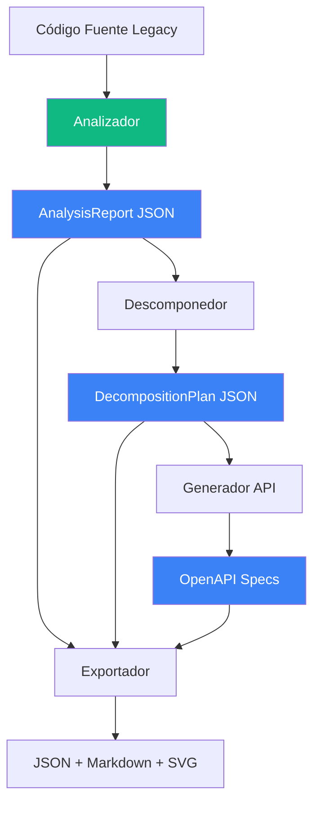
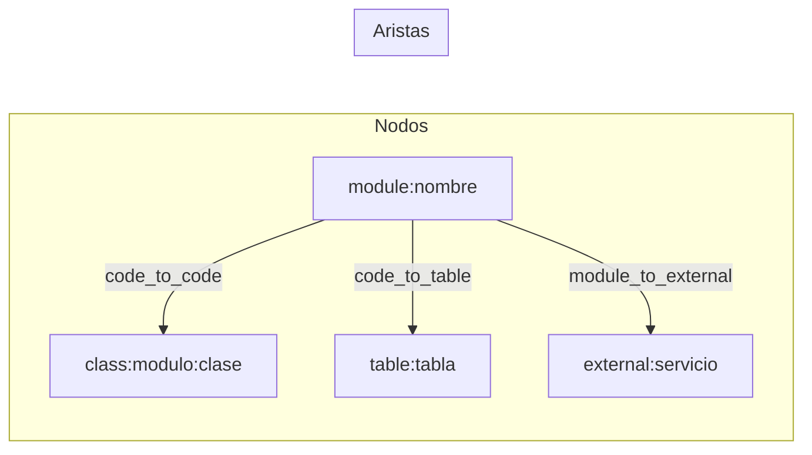
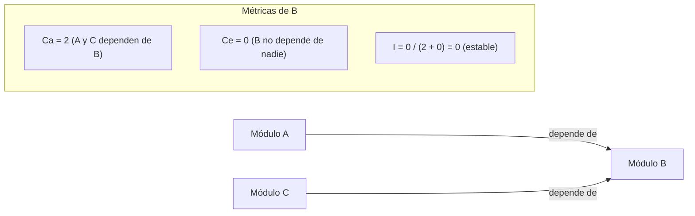
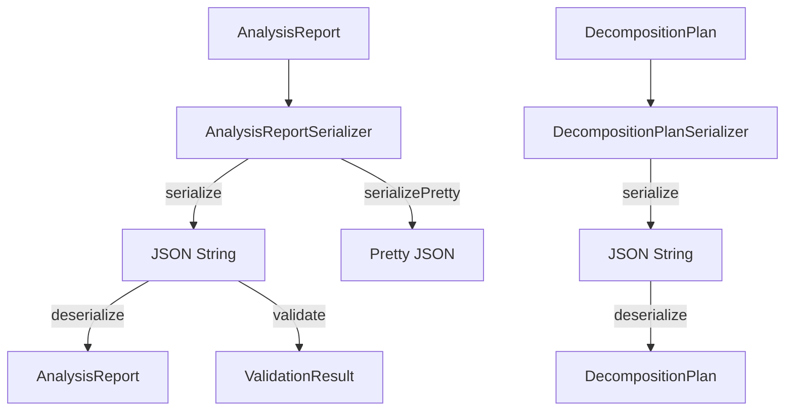
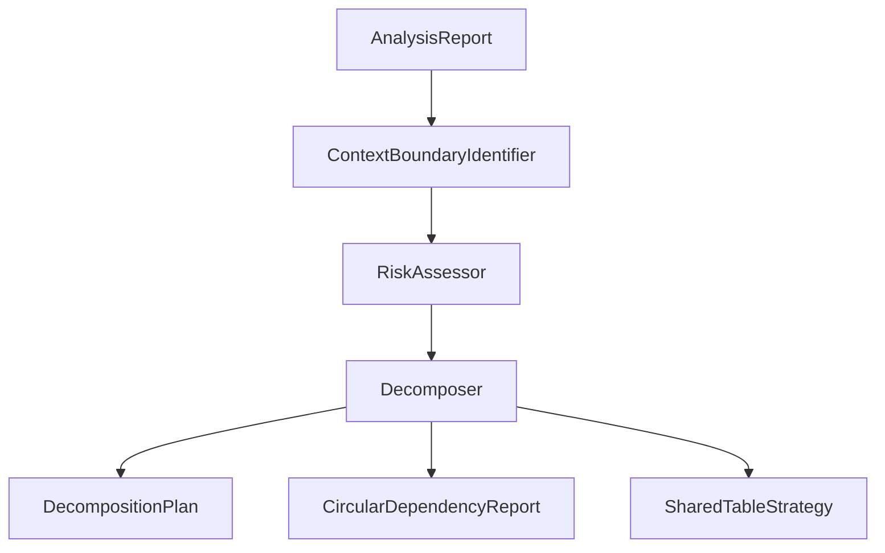
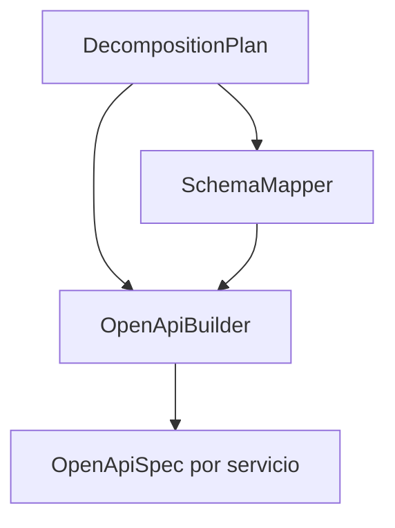
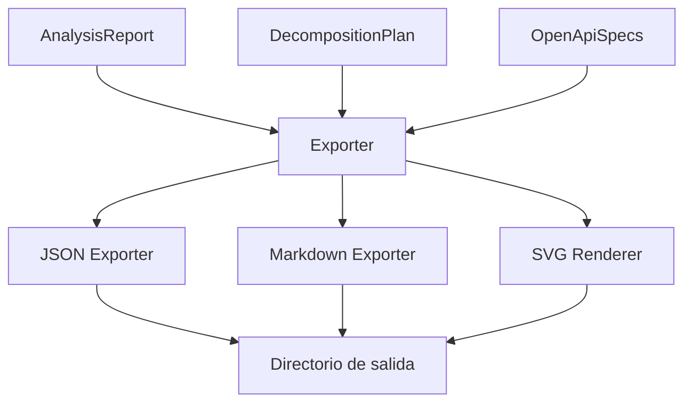
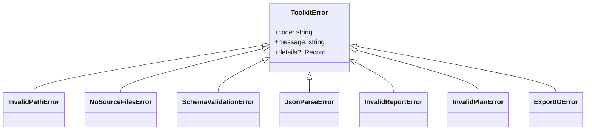

# Arquitectura

## Visión General del Sistema

El ERP Modernization Toolkit es un pipeline de cuatro etapas que transforma código legacy en artefactos de modernización.



## Decisiones de Diseño

| Decisión | Justificación |
|----------|---------------|
| TypeScript | Tipado estático, soporte JSON nativo, ecosistema de análisis |
| Interfaces por componente | Desacoplamiento, testabilidad, extensibilidad |
| JSON como formato de intercambio | Estándar, validable con JSON Schema |
| Plugin registry para parsers | Agregar lenguajes sin modificar código existente |
| SVG programático | Sin dependencias de renderizado externo |

## Arquitectura del Analizador

El Analizador es el módulo más complejo. Orquesta cuatro sub-componentes:

```mermaid
graph TD
    A[Analyzer] --> S[CodeScanner]
    A --> D[DbDependencyDetector]
    A --> G[GraphBuilder]
    A --> M[MetricsCalculator]

    S --> PR[ParserRegistry]
    D --> PR

    PR --> P1[DataFlexParser]
    PR --> P2[CobolParser]
    PR --> P3[AbapParser]
    PR --> P4[RpgParser]
    PR --> P5[Progress4glParser]
    PR --> P6[PlsqlParser]
    PR --> P7[FoxproParser]
    PR --> P8[DelphiParser]
    PR --> P9[PowerBuilderParser]
    PR --> P10[NaturalParser]
    PR --> P11[PickBasicParser]

    S -->|ModuleInfo[]| A
    D -->|DbDependencyMap| A
    G -->|DependencyGraph| A
    M -->|ModuleMetrics[]| A
```

### Componentes

#### ParserRegistry

Registro dinámico que mapea extensiones de archivo a parsers. Cada parser implementa `ILanguageParser`:

```typescript
interface ILanguageParser {
  languageName: string;
  fileExtensions: string[];
  parseFile(filePath: string, content: string): ModuleInfo;
  detectDbAccess(content: string, filePath: string): DbReference[];
}
```

#### CodeScanner

Recorre el sistema de archivos recursivamente, delega el parseo al parser correcto según la extensión, y genera advertencias para archivos no soportados.

#### DbDependencyDetector

Reutiliza los parsers del registry para detectar comandos de acceso a datos específicos de cada lenguaje. También identifica SQL dinámico que no puede analizarse estáticamente.

#### GraphBuilder

Construye el grafo de dependencias integrando módulos y referencias BD:



Convenciones de IDs:
- Módulos: `module:{nombre}`
- Clases: `class:{modulo}:{clase}`
- Tablas: `table:{tabla}`
- Externos: `external:{nombre}`

#### MetricsCalculator

Calcula métricas de acoplamiento a partir del grafo:



## Arquitectura de Serialización



Ambos serializadores implementan `ISerializer<T>` y validan contra un esquema antes de deserializar, lanzando `SchemaValidationError` o `JsonParseError` según corresponda.

## Arquitectura Futura

### Descomponedor (pendiente)



### Generador API (pendiente)



### Exportador (pendiente)



## Jerarquía de Errores


