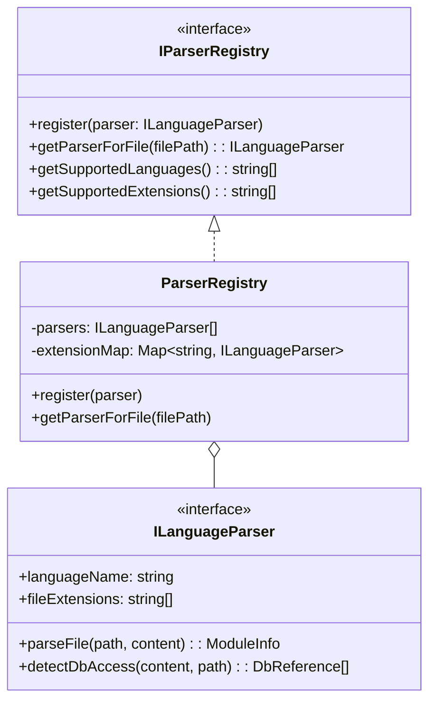
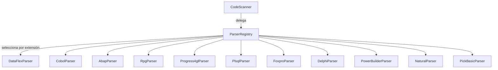
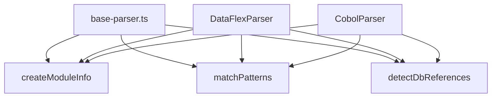
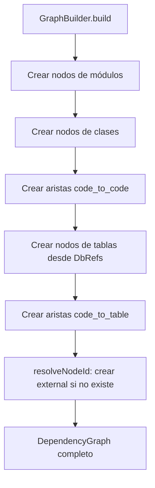
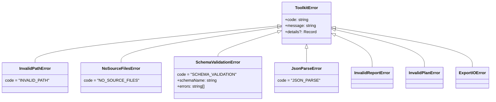

# Patrones de Diseño

## Patrones Aplicados

El toolkit implementa varios patrones de diseño clásicos para lograr extensibilidad, testabilidad y mantenibilidad.

---

## 1. Registry Pattern

**Ubicación:** `ParserRegistry`

**Problema:** Necesitamos soportar 11 lenguajes legacy con la posibilidad de agregar más sin modificar código existente.

**Solución:** Un registro central que mapea extensiones de archivo a implementaciones de parser.



**Cómo agregar un nuevo lenguaje:**

```typescript
import { ILanguageParser, ModuleInfo, DbReference } from '../models/types.js';
import { createModuleInfo, matchPatterns, detectDbReferences } from './base-parser.js';

export class MiLenguajeParser implements ILanguageParser {
  languageName = 'MiLenguaje';
  fileExtensions = ['.ext1', '.ext2'];

  parseFile(filePath: string, content: string): ModuleInfo {
    const classes = []; // detectar clases
    const functions = []; // detectar funciones
    return createModuleInfo(filePath, this.languageName, content, classes, functions);
  }

  detectDbAccess(content: string, filePath: string): DbReference[] {
    return detectDbReferences(content, filePath, moduleName, [
      { pattern: /MI_PATRON_BD\s+(\w+)/i, operation: 'read', queryType: 'table_reference' },
    ]);
  }
}

// Registrar en parsers/index.ts:
registry.register(new MiLenguajeParser());
```

---

## 2. Strategy Pattern

**Ubicación:** Cada `ILanguageParser` es una estrategia de parseo.

**Problema:** Cada lenguaje tiene sintaxis completamente diferente para definir módulos, clases, funciones y acceso a BD.

**Solución:** Interfaz común (`ILanguageParser`) con implementaciones específicas por lenguaje. El `CodeScanner` y `DbDependencyDetector` delegan al parser correcto sin conocer los detalles.



---

## 3. Template Method (via funciones utilitarias)

**Ubicación:** `base-parser.ts`

**Problema:** Todos los parsers comparten la misma estructura: crear `ModuleInfo`, buscar patrones con regex, detectar referencias BD.

**Solución:** Funciones utilitarias compartidas que encapsulan la lógica común:



| Función | Responsabilidad |
|---------|----------------|
| `createModuleInfo()` | Construye `ModuleInfo` con nombre derivado del path |
| `matchPatterns()` | Busca regex línea por línea, retorna nombre + línea |
| `detectDbReferences()` | Busca patrones BD, retorna `DbReference[]` con ubicación |

---

## 4. Facade Pattern

**Ubicación:** `Analyzer`

**Problema:** El análisis requiere coordinar 4 componentes (Scanner, DbDetector, GraphBuilder, MetricsCalculator) en orden específico.

**Solución:** La clase `Analyzer` expone un único método `analyze()` que orquesta todo internamente.

```mermaid
graph TD
    U[Usuario] -->|analyze| A[Analyzer Facade]
    
    A --> S[CodeScanner]
    A --> D[DbDependencyDetector]
    A --> G[GraphBuilder]
    A --> M[MetricsCalculator]

    S -.->|ModuleInfo[]| D
    S -.->|ModuleInfo[]| G
    D -.->|DbDependencyMap| G
    S -.->|ModuleInfo[]| M
    G -.->|DependencyGraph| M
```

El usuario solo necesita:
```typescript
const report = await new Analyzer().analyze('/ruta');
```

---

## 5. Builder Pattern

**Ubicación:** `GraphBuilder`

**Problema:** El grafo de dependencias se construye incrementalmente a partir de múltiples fuentes (módulos, clases, tablas BD, servicios externos).

**Solución:** `GraphBuilder.build()` construye el grafo paso a paso, resolviendo referencias y creando nodos bajo demanda.



---

## 6. Error Hierarchy Pattern

**Ubicación:** `src/models/errors.ts`

**Problema:** Diferentes tipos de error requieren diferente manejo (errores de ruta vs. errores de esquema vs. errores de IO).

**Solución:** Jerarquía de errores tipados con clase base `ToolkitError`:



Permite `instanceof` checks y acceso tipado a `code` y `details`.

---

## Resumen de Patrones

| Patrón | Componente | Beneficio |
|--------|-----------|-----------|
| Registry | ParserRegistry | Extensibilidad de lenguajes |
| Strategy | ILanguageParser | Parseo específico por lenguaje |
| Template Method | base-parser.ts | Reutilización de lógica común |
| Facade | Analyzer | API simple para flujo complejo |
| Builder | GraphBuilder | Construcción incremental del grafo |
| Error Hierarchy | ToolkitError | Manejo de errores tipado y granular |
