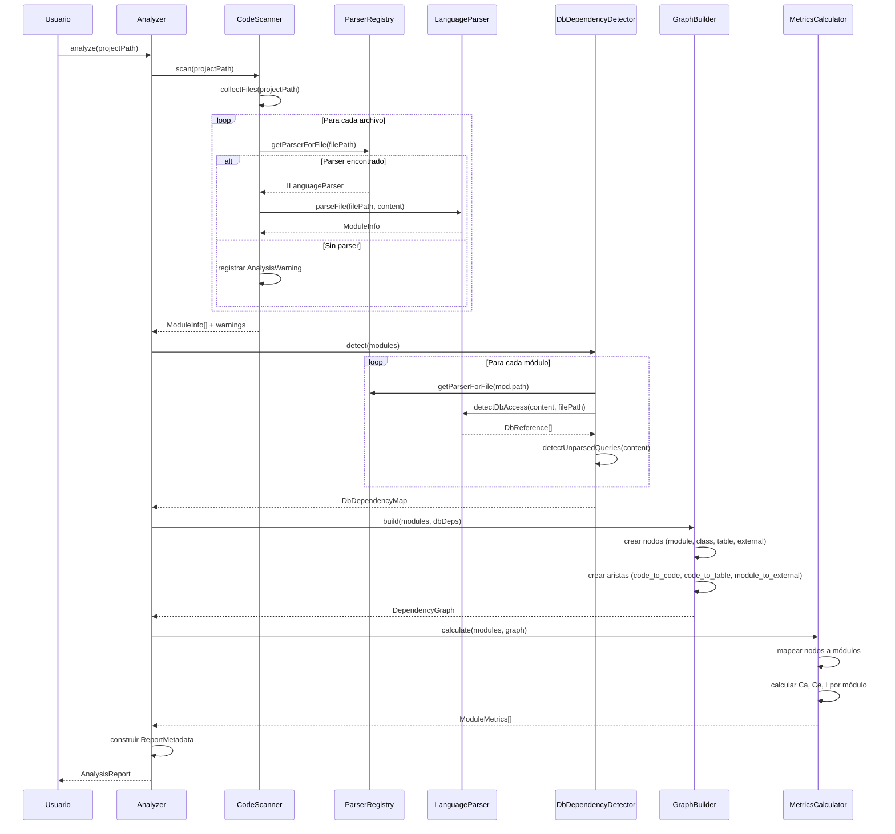
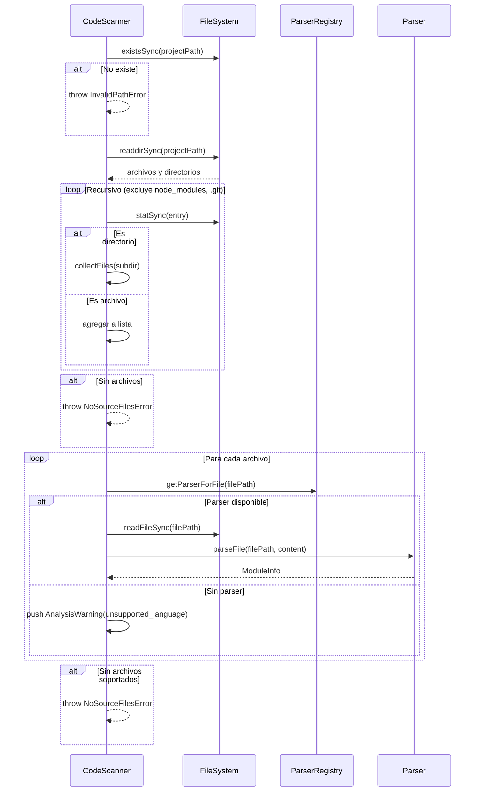
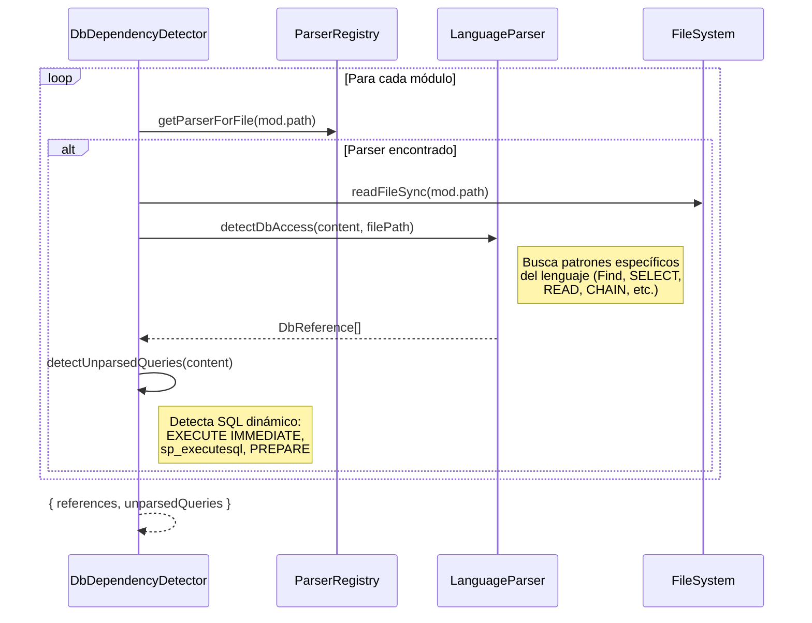
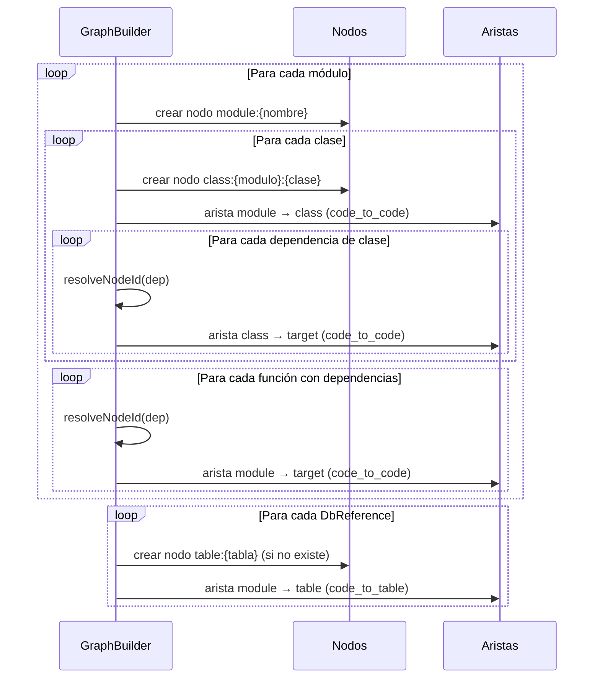
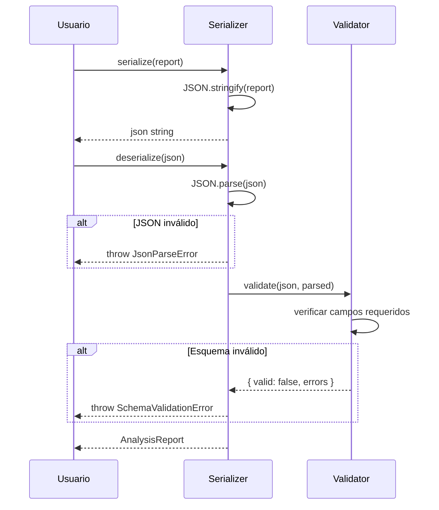
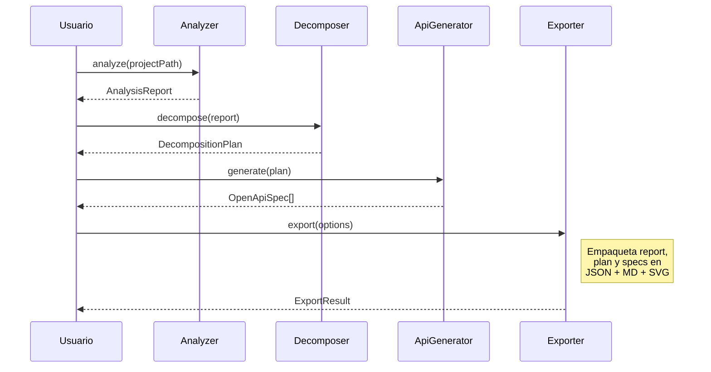

# Diagramas de Secuencia

## Flujo Principal del Análisis

Secuencia completa cuando se invoca `analyzer.analyze(projectPath)`:

## Flujo del Scanner de Código

Detalle del escaneo de archivos y delegación a parsers:

## Flujo de Detección de Dependencias BD

## Flujo de Construcción del Grafo

## Flujo de Serialización (Round-trip)

## Flujo Completo del Pipeline (futuro)

