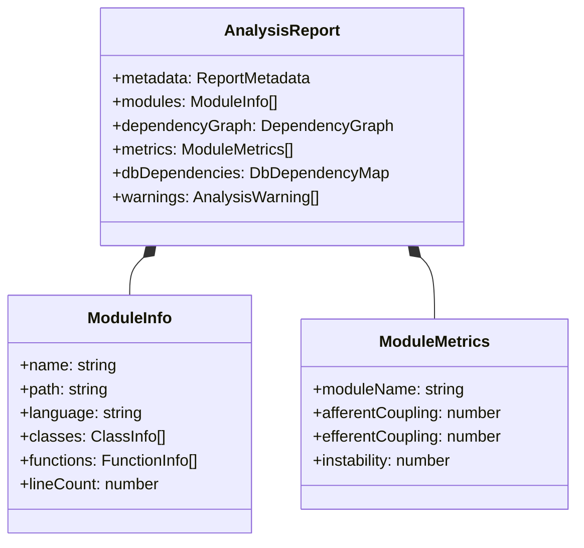
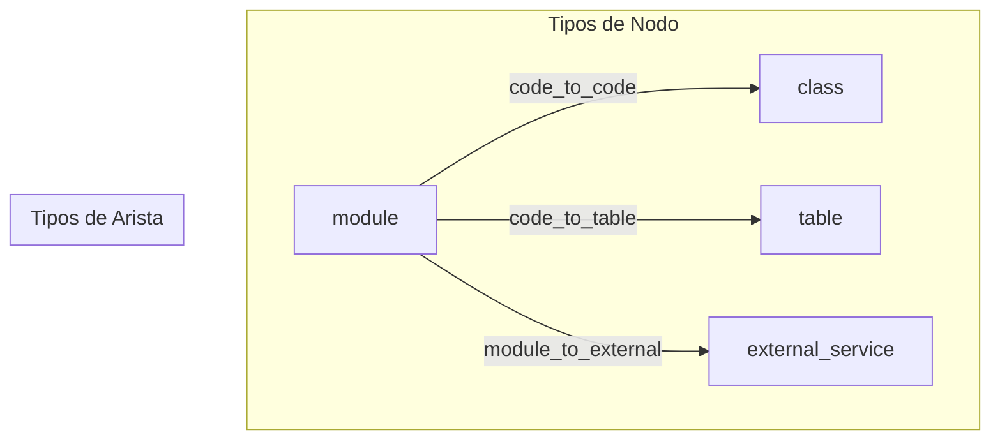

# Guía de Uso

## Instalación

```bash
npm install
npm run build
```

## Análisis de un Proyecto Legacy

### Uso Básico

```typescript
import { Analyzer } from 'erp-modernization-toolkit';

const analyzer = new Analyzer();
const report = await analyzer.analyze('/ruta/proyecto-legacy');

console.log(`Módulos: ${report.modules.length}`);
console.log(`Nodos del grafo: ${report.dependencyGraph.nodes.length}`);
console.log(`Aristas: ${report.dependencyGraph.edges.length}`);
console.log(`Refs BD: ${report.dbDependencies.references.length}`);
```

### Estructura del Reporte

El `AnalysisReport` contiene:



### Métricas de Complejidad

Cada módulo recibe tres métricas:

| Métrica | Fórmula | Descripción |
|---------|---------|-------------|
| Ca (Acoplamiento Aferente) | Conteo | Módulos que dependen de este |
| Ce (Acoplamiento Eferente) | Conteo | Módulos de los que este depende |
| I (Inestabilidad) | Ce / (Ca + Ce) | Rango [0, 1]. Si Ca + Ce = 0, I = 0 |

```typescript
for (const metric of report.metrics) {
  console.log(`${metric.moduleName}: Ca=${metric.afferentCoupling}, Ce=${metric.efferentCoupling}, I=${metric.instability.toFixed(2)}`);
}
```

### Dependencias de Base de Datos

```typescript
// Listar referencias a tablas
for (const ref of report.dbDependencies.references) {
  console.log(`${ref.moduleName} → ${ref.tableName} (${ref.operation}) en ${ref.sourceLocation.filePath}:${ref.sourceLocation.lineNumber}`);
}

// Consultas no parseables (SQL dinámico)
for (const uq of report.dbDependencies.unparsedQueries) {
  console.log(`⚠ ${uq.sourceLocation.filePath}:${uq.sourceLocation.lineNumber} — ${uq.reason}`);
}
```

### Grafo de Dependencias

El grafo usa cuatro tipos de nodos y tres tipos de aristas:



```typescript
for (const node of report.dependencyGraph.nodes) {
  console.log(`[${node.type}] ${node.name} (${node.id})`);
}
for (const edge of report.dependencyGraph.edges) {
  console.log(`${edge.source} --${edge.type}--> ${edge.target}`);
}
```

## Conector de Base de Datos

### Conexión

```typescript
import { DbConnector } from 'erp-modernization-toolkit';
import type { ConnectionConfig } from 'erp-modernization-toolkit';

const config: ConnectionConfig = {
  databaseType: 'postgresql',  // 'postgresql' | 'mysql' | 'mssql' | 'oracle' | 'db2'
  host: 'localhost',
  port: 5432,
  databaseName: 'erp_legacy',
  username: '[user]',
  password: '[password]',
};

const connector = new DbConnector();
await connector.connect(config);

const adapter = connector.getAdapter();
const healthy = await adapter.healthCheck();

// Al finalizar
await connector.disconnect();
```

### Introspección de Esquemas

```typescript
import { DbIntrospector } from 'erp-modernization-toolkit';

const introspector = new DbIntrospector(adapter);

// Listar tablas
const tables = await introspector.listTables('public');

// Obtener esquema de una tabla
const schema = await introspector.getTableSchema('customers', 'public');
console.log(`Columnas: ${schema.columns.length}`);
console.log(`PK: ${schema.primaryKey.columns.join(', ')}`);
console.log(`FKs: ${schema.foreignKeys.length}`);

// Obtener esquemas en batch
const schemas = await introspector.getMultipleTableSchemas(tables, 'public');
for (const [name, tableSchema] of schemas) {
  if (tableSchema) {
    console.log(`${name}: ${tableSchema.columns.length} columnas`);
  } else {
    console.log(`${name}: no encontrada`);
  }
}
```

### Validación de Dependencias

Compara las tablas referenciadas en el código legacy contra las tablas reales en la BD:

```typescript
import { TableValidator } from 'erp-modernization-toolkit';

const validator = new TableValidator(adapter, config);
const validationReport = await validator.validate(report.dbDependencies, 'public');

console.log(`Total referencias: ${validationReport.summary.totalReferences}`);
console.log(`Encontradas: ${validationReport.summary.foundCount}`);
console.log(`No encontradas: ${validationReport.summary.notFoundCount}`);

// Tablas no encontradas con sugerencias fuzzy
for (const result of validationReport.results) {
  if (result.status === 'not_found') {
    console.log(`❌ ${result.tableName} — sugerencias: ${result.suggestions?.join(', ')}`);
  }
}
```

### Enriquecimiento de Planes

Agrega metadata real de BD a un `DecompositionPlan`:

```typescript
import { PlanEnricher } from 'erp-modernization-toolkit';

const enricher = new PlanEnricher(introspector, config);
const enrichedPlan = await enricher.enrich(decompositionPlan, 'public');

// Schemas reales por servicio
for (const svc of enrichedPlan.enrichment.serviceSchemas) {
  console.log(`${svc.serviceName}: ${svc.tableSchemas.length} schemas`);
}

// Foreign keys que cruzan fronteras de servicio
for (const fk of enrichedPlan.enrichment.crossServiceForeignKeys) {
  console.log(`${fk.sourceService}.${fk.sourceTable} → ${fk.targetService}.${fk.targetTable}`);
}

// Tablas sin validar
console.log(`Sin validar: ${enrichedPlan.enrichment.unvalidatedTables.join(', ')}`);
```

## Generador de APIs

### Generación desde Plan Enriquecido

```typescript
import { EnrichedSchemaMapper, generateOpenApiFromEnrichedPlan } from 'erp-modernization-toolkit';

const mapper = new EnrichedSchemaMapper();
const specs = generateOpenApiFromEnrichedPlan(enrichedPlan, mapper);

for (const spec of specs) {
  console.log(`${spec.info.title}: ${Object.keys(spec.paths).length} paths`);
  console.log(`Schemas: ${Object.keys(spec.components.schemas).length}`);
}
```

El generador produce un `OpenApiSpec` por cada servicio del plan:
- Tablas validadas: endpoints CRUD completos con schemas precisos basados en columnas reales, parámetros de path tipados según primary keys
- Tablas no validadas: endpoints CRUD con schemas inferidos mínimos y advertencia `[WARNING: schema inferred]`

Endpoints generados por tabla:
- `GET /{tabla}` — Listar todos
- `POST /{tabla}` — Crear
- `GET /{tabla}/{pk}` — Obtener por PK
- `PUT /{tabla}/{pk}` — Actualizar por PK
- `DELETE /{tabla}/{pk}` — Eliminar por PK

### Mapeo de Tipos de Columna

El `EnrichedSchemaMapper` convierte tipos de BD a tipos OpenAPI:

| Tipo BD | Tipo OpenAPI | Formato |
|---------|-------------|---------|
| INTEGER, INT, SMALLINT, SERIAL | integer | int32 |
| BIGINT | integer | int64 |
| FLOAT, REAL | number | float |
| DOUBLE, DECIMAL, NUMERIC | number | double |
| BOOLEAN, BOOL | boolean | — |
| DATE | string | date |
| TIMESTAMP, DATETIME | string | date-time |
| BLOB, BYTEA, BINARY | string | byte |
| UUID, UNIQUEIDENTIFIER | string | uuid |
| VARCHAR, TEXT, CHAR | string | — |

## Serialización

### Guardar y Cargar Reportes

```typescript
import { AnalysisReportSerializer } from 'erp-modernization-toolkit';

const serializer = new AnalysisReportSerializer();

// Serializar
const json = serializer.serialize(report);
const prettyJson = serializer.serializePretty(report);

// Deserializar (valida esquema automáticamente)
const loaded = serializer.deserialize(json);

// Validar sin deserializar
const result = serializer.validate(json);
if (!result.valid) {
  console.error('Errores:', result.errors);
}
```

### Planes de Descomposición

```typescript
import { DecompositionPlanSerializer } from 'erp-modernization-toolkit';

const planSerializer = new DecompositionPlanSerializer();
const planJson = planSerializer.serialize(plan);
const loadedPlan = planSerializer.deserialize(planJson);
```

### Reportes de Validación

```typescript
import { ValidationReportSerializer } from 'erp-modernization-toolkit';

const valSerializer = new ValidationReportSerializer();
const valJson = valSerializer.serializePretty(validationReport);
const loadedVal = valSerializer.deserialize(valJson);
```

## Manejo de Errores

Todos los errores extienden de `ToolkitError`:

```typescript
import {
  Analyzer,
  InvalidPathError,
  NoSourceFilesError,
  ConnectionError,
  TableNotFoundError,
} from 'erp-modernization-toolkit';

try {
  const report = await analyzer.analyze('/ruta/inexistente');
} catch (err) {
  if (err instanceof InvalidPathError) {
    console.error(`Ruta inválida: ${err.details?.path}`);
  } else if (err instanceof NoSourceFilesError) {
    console.error('No se encontraron archivos fuente');
  }
}

try {
  await connector.connect(config);
} catch (err) {
  if (err instanceof ConnectionError) {
    console.error(`Conexión fallida: ${err.message}`);
  }
}
```

| Error | Código | Cuándo ocurre |
|-------|--------|---------------|
| `InvalidPathError` | `INVALID_PATH` | Ruta no existe |
| `NoSourceFilesError` | `NO_SOURCE_FILES` | Sin archivos fuente válidos |
| `SchemaValidationError` | `SCHEMA_VALIDATION` | JSON no cumple esquema |
| `JsonParseError` | `JSON_PARSE` | JSON con sintaxis inválida |
| `InvalidReportError` | `INVALID_REPORT` | Reporte inválido |
| `InvalidPlanError` | `INVALID_PLAN` | Plan inválido |
| `ExportIOError` | `EXPORT_IO` | Error de escritura en disco |
| `ConnectionError` | `DB_CONNECTION` | Fallo de conexión a BD |
| `ConnectionLostError` | `DB_CONNECTION_LOST` | Conexión perdida durante operación |
| `TableNotFoundError` | `TABLE_NOT_FOUND` | Tabla no encontrada en BD |
| `IntrospectionError` | `INTROSPECTION` | Fallo al introspeccionar tabla |

## Uso Avanzado: Componentes Individuales

Cada componente puede usarse de forma independiente:

```typescript
import {
  createDefaultRegistry,
  CodeScanner,
  DbDependencyDetector,
  MetricsCalculator,
  GraphBuilder,
} from 'erp-modernization-toolkit';

const registry = createDefaultRegistry();

// Solo escanear módulos
const scanner = new CodeScanner(registry);
const modules = await scanner.scan('/ruta/proyecto');

// Solo detectar dependencias BD
const detector = new DbDependencyDetector(registry);
const dbDeps = await detector.detect(modules);

// Solo construir grafo
const builder = new GraphBuilder();
const graph = builder.build(modules, dbDeps);

// Solo calcular métricas
const calculator = new MetricsCalculator();
const metrics = calculator.calculate(modules, graph);
```

## Ejemplo Completo: Pipeline de Migración

Ver [`example_usage/legacy-erp-migration.ts`](../example_usage/legacy-erp-migration.ts) para un ejemplo completo que ejecuta todas las fases del pipeline:

1. Conexión a BD PostgreSQL real
2. Descubrimiento e introspección de esquemas
3. Análisis estático del código legacy
4. Validación de dependencias contra BD real
5. Plan de descomposición en microservicios
6. Enriquecimiento con metadata real de BD
7. Generación de OpenAPI specs por microservicio
8. Exportación de reportes JSON

```bash
export DB_HOST=localhost DB_PORT=5432 DB_NAME=erp_legacy DB_USER=[user] DB_PASSWORD=[password]
npx tsx example_usage/legacy-erp-migration.ts
```
