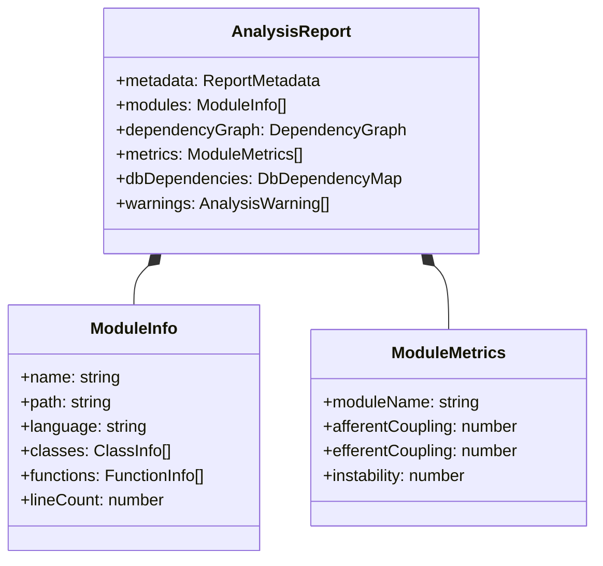
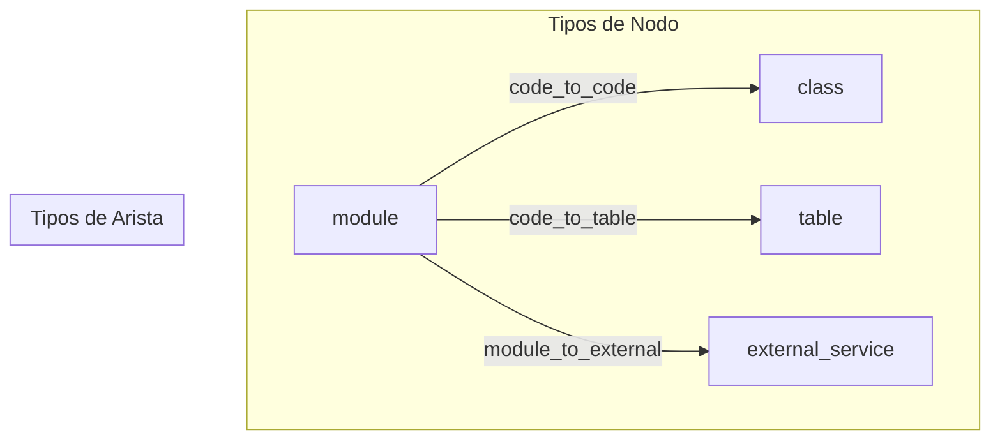

# Guía de Uso

## Instalación

```bash
npm install
npm run build
```

## Análisis de un Proyecto Legacy

### Uso Básico

```typescript
import { Analyzer } from 'erp-modernization-toolkit';

const analyzer = new Analyzer();
const report = await analyzer.analyze('/ruta/proyecto-legacy');

console.log(`Módulos: ${report.modules.length}`);
console.log(`Nodos del grafo: ${report.dependencyGraph.nodes.length}`);
console.log(`Aristas: ${report.dependencyGraph.edges.length}`);
console.log(`Refs BD: ${report.dbDependencies.references.length}`);
```

### Estructura del Reporte

El `AnalysisReport` contiene:



### Métricas de Complejidad

Cada módulo recibe tres métricas:

| Métrica | Fórmula | Descripción |
|---------|---------|-------------|
| Ca (Acoplamiento Aferente) | Conteo | Módulos que dependen de este |
| Ce (Acoplamiento Eferente) | Conteo | Módulos de los que este depende |
| I (Inestabilidad) | Ce / (Ca + Ce) | Rango [0, 1]. Si Ca + Ce = 0, I = 0 |

```typescript
// Acceder a métricas por módulo
for (const metric of report.metrics) {
  console.log(`${metric.moduleName}: Ca=${metric.afferentCoupling}, Ce=${metric.efferentCoupling}, I=${metric.instability.toFixed(2)}`);
}
```

### Dependencias de Base de Datos

```typescript
// Listar referencias a tablas
for (const ref of report.dbDependencies.references) {
  console.log(`${ref.moduleName} → ${ref.tableName} (${ref.operation}) en ${ref.sourceLocation.filePath}:${ref.sourceLocation.lineNumber}`);
}

// Consultas no parseables (SQL dinámico)
for (const uq of report.dbDependencies.unparsedQueries) {
  console.log(`⚠ ${uq.sourceLocation.filePath}:${uq.sourceLocation.lineNumber} — ${uq.reason}`);
}
```

### Grafo de Dependencias

El grafo usa cuatro tipos de nodos y tres tipos de aristas:



```typescript
// Recorrer el grafo
for (const node of report.dependencyGraph.nodes) {
  console.log(`[${node.type}] ${node.name} (${node.id})`);
}
for (const edge of report.dependencyGraph.edges) {
  console.log(`${edge.source} --${edge.type}--> ${edge.target}`);
}
```

## Serialización

### Guardar y Cargar Reportes

```typescript
import { AnalysisReportSerializer } from 'erp-modernization-toolkit';

const serializer = new AnalysisReportSerializer();

// Serializar
const json = serializer.serialize(report);
const prettyJson = serializer.serializePretty(report); // indentación 2 espacios

// Deserializar
const loaded = serializer.deserialize(json);

// Validar sin deserializar
const result = serializer.validate(json);
if (!result.valid) {
  console.error('Errores:', result.errors);
}
```

### Planes de Descomposición

```typescript
import { DecompositionPlanSerializer } from 'erp-modernization-toolkit';

const planSerializer = new DecompositionPlanSerializer();
const planJson = planSerializer.serialize(plan);
const loadedPlan = planSerializer.deserialize(planJson);
```

## Manejo de Errores

Todos los errores extienden de `ToolkitError`:

```typescript
import { Analyzer, InvalidPathError, NoSourceFilesError } from 'erp-modernization-toolkit';

try {
  const report = await analyzer.analyze('/ruta/inexistente');
} catch (err) {
  if (err instanceof InvalidPathError) {
    console.error(`Ruta inválida: ${err.details?.path}`);
  } else if (err instanceof NoSourceFilesError) {
    console.error('No se encontraron archivos fuente');
  }
}
```

| Error | Código | Cuándo ocurre |
|-------|--------|---------------|
| `InvalidPathError` | `INVALID_PATH` | Ruta no existe |
| `NoSourceFilesError` | `NO_SOURCE_FILES` | Sin archivos fuente válidos |
| `SchemaValidationError` | `SCHEMA_VALIDATION` | JSON no cumple esquema |
| `JsonParseError` | `JSON_PARSE` | JSON con sintaxis inválida |
| `InvalidReportError` | `INVALID_REPORT` | Reporte inválido |
| `InvalidPlanError` | `INVALID_PLAN` | Plan inválido |
| `ExportIOError` | `EXPORT_IO` | Error de escritura en disco |

## Uso Avanzado: Componentes Individuales

Cada componente del Analizador puede usarse de forma independiente:

```typescript
import {
  createDefaultRegistry,
  CodeScanner,
  DbDependencyDetector,
  MetricsCalculator,
  GraphBuilder,
} from 'erp-modernization-toolkit';

const registry = createDefaultRegistry();

// Solo escanear módulos
const scanner = new CodeScanner(registry);
const modules = await scanner.scan('/ruta/proyecto');

// Solo detectar dependencias BD
const detector = new DbDependencyDetector(registry);
const dbDeps = await detector.detect(modules);

// Solo construir grafo
const builder = new GraphBuilder();
const graph = builder.build(modules, dbDeps);

// Solo calcular métricas
const calculator = new MetricsCalculator();
const metrics = calculator.calculate(modules, graph);
```
